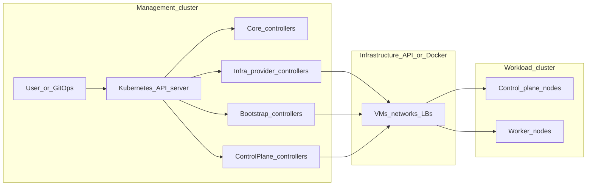

# Developer's Guide to Cluster API (CAPI)

**Location:** [`contrib-notes/onboarding/`](.) — personal / contributor onboarding (not the published book). Master index: [`contrib-notes/INDEX.md`](../INDEX.md).

This guide orients computer science students and junior engineers who want to understand **kubernetes-sigs/cluster-api** and make their first upstream contributions. Cluster API is a large, mature codebase; you do not need to memorize every controller on day one. The goal is to internalize the *mental model*, know *where to look* in the tree, and run a tight *local inner loop* before you open a pull request.

For deeper reading as you go, the official book is published at [cluster-api.sigs.k8s.io](https://cluster-api.sigs.k8s.io). This page complements the official book: [Getting started](https://cluster-api.sigs.k8s.io/developer/getting-started.html), [Repository layout](https://cluster-api.sigs.k8s.io/developer/core/repository-layout.html), [Tilt](https://cluster-api.sigs.k8s.io/developer/core/tilt.html), and [Testing](https://cluster-api.sigs.k8s.io/developer/core/testing.html).

> **Hinglish:** *Ek baat clear rakho: CAPI poora cluster “YAML se manage” karne ka framework hai—controllers background mein cloud/API calls karte hain. Pehle din se sab controller yaad karne ki zaroorat nahi; mental model + repo map pakki karo, baaki time ke saath aayega.*

---

## High-level architecture: the CAPI mental model

### Declarative lifecycle, level-triggered reconciliation

Cluster API follows the same core Kubernetes idea as Deployments or StatefulSets:

- You store **desired state** as objects in the API server (Custom Resources).
- **Controllers** (operators) watch those objects and the wider cluster state.
- Each controller runs a **reconciliation loop**: compare desired vs actual, act (create, update, delete external resources or other objects), then requeue or stop until something changes again.

This is **level-triggered** behavior: if an event is missed, the next resync or dependency change still drives the system toward the desired state. That is why controllers must be **idempotent**—running `Reconcile` twice for the same object should be safe.

CAPI applies that pattern to **entire Kubernetes clusters**: networks, machines, bootstrap scripts, control plane membership, and (with ClusterClass and topology) templated cluster shapes.

### Management cluster versus workload cluster

| | **Management cluster** | **Workload cluster** |
|---|------------------------|----------------------|
| **Role** | Hosts Cluster API *core* and *provider* controllers; stores CAPI CRs (`Cluster`, `Machine`, …). | The Kubernetes cluster whose lifecycle you are managing; runs user workloads. |
| **Typical contents** | `cluster-api-controller-manager`, kubeadm bootstrap/control-plane managers, infrastructure provider (e.g. CAPA, CAPD), cert-manager, webhooks. | kube-apiserver, etcd, kubelets, CNI, your apps. |
| **Where reconciliation runs** | Here: controllers talk to cloud APIs, Docker, etc., and write status back to CRs. | After bootstrap, mostly **not** here for CAPI—though controllers may use a **remote cluster cache** to read workload-cluster state when needed. |

The **Cluster** CR in the management cluster *represents* a workload cluster. It references provider-specific infrastructure and control-plane objects via `infrastructureRef` and `controlPlaneRef`. Portable fields (for example cluster network CIDRs) live on `Cluster`; provider-specific details live on those referenced types.

**Important nuance:** During early bootstrap, some flows coordinate “who goes first” (for example bootstrap data gating node creation). Once nodes exist, the workload cluster is a normal Kubernetes cluster from the application’s perspective.

> **Hinglish:** *Short mein: **management** = jahan CAPI “remote control” baith kar clusters banata hai; **workload** = jahan tumhara app chalta hai. Context switch galat hua to disaster—`kubectl config` ka naam achha rakho (`mgmt-prod`, `workload-prod`).*

### The four provider types (and a single analogy)

Think of building a **house**:

1. **Core (Cluster API)** — *General contractor*  
   Owns the portable contract: `Cluster`, `Machine`, `MachineSet`, `MachineDeployment`, `MachineHealthCheck`, topology / `ClusterClass`, conditions, and orchestration between other providers. It does not know AWS vs GCP; it knows how to wire references and drive lifecycle.

2. **Infrastructure provider** — *Lot, foundation hookups, physical shell*  
   Provisions VMs (or containers in CAPD), networks, load balancers, disks—whatever “a Machine runs on.” Examples: `AWSMachine`, `DockerMachine`. Implements the *infrastructure* contract (see [InfraCluster / InfraMachine](https://cluster-api.sigs.k8s.io/developer/providers/contracts/infra-cluster.html)).

3. **Bootstrap provider** — *Move-in packet for each Machine*  
   Turns “a server exists” into “a Kubernetes Node exists”: cloud-init/Ignition, certificates, `kubeadm init` / `join`, and ordering so the control plane is ready before workers flood in. The reference implementation is **Kubeadm bootstrap** (`KubeadmConfig`, templates).

4. **Control plane provider** — *Structural frame of the house (control plane)*  
   Manages **how many** control plane Machines exist and how they form a coherent control plane (etcd, version upgrades, rollout). The reference implementation is **KubeadmControlPlane**—a set of Machines running the control plane via kubeadm’s static pods model.

Together: **Core** coordinates; **Infrastructure** creates the compute; **Bootstrap** prepares each Machine’s first-boot script; **Control plane** scales and upgrades the control plane Machines as a group.

> **Hinglish:** *Ghar banane wali analogy yaad rakhna easy hai—**core** contractor hai, **infra** zameen+shell, **bootstrap** pehli baar ghar mein ghusne ka “welcome kit”, **control plane** structure jo poora ghar sambhalta hai (boss nodes / etcd story).*

### Objects you will see in almost every cluster

- **`Cluster`**: Namespaced declaration of a workload cluster; links infra + control plane refs.
- **`Machine`**: One host ↔ one intended Node; references `infrastructureRef` and bootstrap `configRef`.
- **`MachineSet`**: Stable set of Machines (like a ReplicaSet for Machines); usually not edited directly.
- **`MachineDeployment`**: Declarative rollout of worker Machines (like a Deployment).
- **`KubeadmControlPlane`**: Declarative control plane for the kubeadm-based stack.

**Machine immutability:** In CAPI, Machines are generally **immutable** after creation (except labels, annotations, status). Spec changes roll out by **replacing** Machines—similar to Pods rolling under a Deployment. That design contains blast radius and keeps reconciliation predictable.

### Cluster API as a system of multiple binaries

Production setups run **separate controller managers** (separate Deployments) for core, bootstrap, control plane, and each infrastructure provider. They share CRDs and RBAC but scale and ship independently. Local development often uses **Tilt** to build and load all of them into one **kind** management cluster.

### Architecture diagram (data flow)



For illustrated glossary content, see [Concepts](https://cluster-api.sigs.k8s.io/user/concepts.html) and the management cluster figure there.

---

## Core technologies and patterns

> **Hinglish:** *Neeche wale sections mein “Kubernetes duniya ke standard tools” hain—CRD, controller-runtime, kubebuilder markers. Inke bina CAPI jaldi se itna bada maintain nahi ho paata.*

### Kubernetes operator pattern and Custom Resource Definitions

**CRDs** extend the API server with new kinds (`Cluster`, `Machine`, …). They define schema (OpenAPI validation), defaulting, and sometimes conversion between API versions.

**Operators** in this context are:

- **Controllers** that implement business logic for those CRs.
- Often **admission webhooks** (mutating/validating) for defaults and policy.
- **RBAC** and **cert-manager**-backed TLS for webhooks and apiservers.

CAPI’s core types live under [`api/`](https://github.com/kubernetes-sigs/cluster-api/tree/main/api) in this repository (for example `api/core/v1beta2` for the current core API line). Generated CRD YAML is under [`config/crd/bases`](https://github.com/kubernetes-sigs/cluster-api/tree/main/config/crd/bases).

### controller-runtime

[controller-runtime](https://github.com/kubernetes-sigs/controller-runtime) is the shared Go library behind most Kubernetes operators. It provides:

- **`Manager`**: Runs controllers and webhooks, shares a cache and clients.
- **`Client`**: Typed read/write to the API server with cache integration.
- **`Reconciler`**: Your loop entry point for one or more kinds.
- **Watches**: Map incoming events to reconcile requests (often `For` + `Owns` + `Watches`).
- **Webhook server**: Integrates with cert rotation and admission.

CAPI’s core manager entrypoint is [`main.go`](https://github.com/kubernetes-sigs/cluster-api/blob/main/main.go) at the repository root (`cluster-api-controller-manager`). It registers API schemes, feature gates, webhooks, concurrency settings, and the controllers under [`controllers/`](https://github.com/kubernetes-sigs/cluster-api/tree/main/controllers) that wire into implementations in [`internal/controllers/`](https://github.com/kubernetes-sigs/cluster-api/tree/main/internal/controllers).

### Kubebuilder and code generation

[Kubebuilder](https://book.kubebuilder.io/) (and the same marker ecosystem used across Kubernetes SIGs) drives **codegen** from Go types:

- **`deepcopy-gen`** style generation → `zz_generated.deepcopy.go` files.
- **Conversion** between API versions → `zz_generated.conversion.go` and hub/spoke patterns.
- **controller-gen** → CRDs, RBAC manifests, webhook scaffolding from `+kubebuilder` and `+rbac` markers on types and reconcilers.

In this repo, **`make generate`** runs module tidy, manifest generation, deepcopy, conversions, and OpenAPI-related generation (see the Makefile `generate` target). After editing API types or markers, you **must** regenerate and commit the output.

### The reconciler loop in Go

A typical reconciler implements:

```go
func (r *MyReconciler) Reconcile(ctx context.Context, req ctrl.Request) (ctrl.Result, error) {
    // 1. Fetch the object. If deleted, handle finalizers and return.
    // 2. Validate prerequisites (refs, owner cluster, feature gates).
    // 3. Compare spec to status / external world; patch status with conditions.
    // 4. Return ctrl.Result{RequeueAfter: duration} on backoff, or transient errors.
    // 5. Return zero Result, nil when fully reconciled until the next watch.
}
```

**Practices you will see everywhere:**

- **Conditions** on status (Ready, Available, …) for user-visible progress.
- **Finalizers** to delay deletion until external resources are cleaned up.
- **Owner references** so garbage collection and watch fan-out behave correctly.
- **Patch helpers** and server-side apply patterns to avoid clobbering fields.
- **Leader election** so only one active manager instance mutates shared state.

The **public** [`controllers/`](https://github.com/kubernetes-sigs/cluster-api/tree/main/controllers) package exposes setup functions for embedding or testing; the **internal** implementation detail lives in [`internal/controllers/`](https://github.com/kubernetes-sigs/cluster-api/tree/main/internal/controllers) so the project can evolve without expanding the supported Go API surface.

### Testing layers (conceptual)

- **Unit tests**: Pure helpers, patches, predicates.
- **Integration tests**: [`envtest`](https://book.kubebuilder.io/reference/envtest.html)—real `kube-apiserver` + `etcd` binaries, no kubelet or cloud. CAPI wraps this in [`internal/test/envtest`](https://github.com/kubernetes-sigs/cluster-api/tree/main/internal/test/envtest); controller suites use `suite_test.go` patterns with `KUBEBUILDER_ASSETS`.
- **E2E tests**: Full management cluster, real provider stack (often CAPD locally), [Ginkgo](https://onsi.github.io/ginkgo/) + [clusterctl](https://github.com/kubernetes-sigs/cluster-api/tree/main/cmd/clusterctl) flows—see [`test/e2e`](https://github.com/kubernetes-sigs/cluster-api/tree/main/test/e2e).

---

## Repository map: guided tour

> **Hinglish:** *Neeche wala table “map” hai—kho jao to yahi se wapas aa jao. Aur detail + code ke liye [Repository deep dive](./repository-deep-dive/overview.md) chapter dekho.*

The table below maps **topics** to **directories** in **kubernetes-sigs/cluster-api**. Paths are from the repo root.

| Topic | Location |
|-------|----------|
| Core API types (`Cluster`, `Machine`, …) | [`api/core/`](https://github.com/kubernetes-sigs/cluster-api/tree/main/api/core) |
| Addons, IPAM, Runtime SDK API | [`api/addons/`](https://github.com/kubernetes-sigs/cluster-api/tree/main/api/addons), [`api/ipam/`](https://github.com/kubernetes-sigs/cluster-api/tree/main/api/ipam), [`api/runtime/`](https://github.com/kubernetes-sigs/cluster-api/tree/main/api/runtime) |
| Kubeadm bootstrap API | [`api/bootstrap/kubeadm/`](https://github.com/kubernetes-sigs/cluster-api/tree/main/api/bootstrap/kubeadm) |
| Kubeadm control plane API | [`api/controlplane/kubeadm/`](https://github.com/kubernetes-sigs/cluster-api/tree/main/api/controlplane/kubeadm) |
| Core CRDs, RBAC, manager, webhook kustomize | [`config/`](https://github.com/kubernetes-sigs/cluster-api/tree/main/config) (CRD bases in `config/crd/bases`) |
| Core controller **implementation** | [`internal/controllers/`](https://github.com/kubernetes-sigs/cluster-api/tree/main/internal/controllers) |
| Public controller setup (embedding) | [`controllers/`](https://github.com/kubernetes-sigs/cluster-api/tree/main/controllers) |
| Kubeadm bootstrap controllers | [`bootstrap/kubeadm/`](https://github.com/kubernetes-sigs/cluster-api/tree/main/bootstrap/kubeadm) |
| Kubeadm control plane controllers | [`controlplane/kubeadm/`](https://github.com/kubernetes-sigs/cluster-api/tree/main/controlplane/kubeadm) |
| CAPD (Docker infrastructure, dev/test) | [`test/infrastructure/docker/`](https://github.com/kubernetes-sigs/cluster-api/tree/main/test/infrastructure/docker) |
| clusterctl CLI | [`cmd/clusterctl/`](https://github.com/kubernetes-sigs/cluster-api/tree/main/cmd/clusterctl) |
| E2E suite | [`test/e2e/`](https://github.com/kubernetes-sigs/cluster-api/tree/main/test/e2e) (suite entry: `e2e_suite_test.go`) |
| E2E framework helpers | [`test/framework/`](https://github.com/kubernetes-sigs/cluster-api/tree/main/test/framework) |
| envtest wrapper | [`internal/test/envtest/`](https://github.com/kubernetes-sigs/cluster-api/tree/main/internal/test/envtest) |
| Proposals (CAEPs) | [`docs/proposals/`](https://github.com/kubernetes-sigs/cluster-api/tree/main/docs/proposals) |
| Developer book source (this page) | [`docs/book/src/`](https://github.com/kubernetes-sigs/cluster-api/tree/main/docs/book/src) |

Bootstrap and control-plane each have their own `config/` subtree (CRDs, RBAC, webhooks) generated the same way as core.

---

## Developer workflow and force multipliers

> **Hinglish:** *Inner loop yaad rakho: code badla → `make generate` (agar API/markers chhuye) → `make test` → `make lint` → PR. Local cluster ke liye kind + Tilt best combo hai—baar baar docker push se zyada tez.*

### First-day checklist

1. Clone [kubernetes-sigs/cluster-api](https://github.com/kubernetes-sigs/cluster-api) into your Go workspace.
2. Install Go at the version the repo expects (see the root `Makefile` variables `GO_VERSION` / `GO_DIRECTIVE_VERSION`).
3. Run codegen and tests locally (below).
4. For a realistic loop, create a kind cluster and use Tilt (see [Tilt](https://cluster-api.sigs.k8s.io/developer/core/tilt.html)).

### Essential Makefile targets

From the repository root:

```bash
# Regenerate Go helpers (deepcopy, conversion, etc.), OpenAPI-related output,
# and all provider manifest bundles (core, kubeadm bootstrap/cp, CAPD, …).
make generate
```

```bash
# Run unit and integration tests (race detector + conversion fuzz pass).
# Requires envtest assets; the Makefile invokes setup-envtest to resolve KUBEBUILDER_ASSETS.
make test
```

```bash
# Refresh CRD / RBAC / webhook YAML from Go types and kubebuilder markers.
# There is no `make manifests` target in this repo—use generate-manifests.
make generate-manifests
```

```bash
# Create a kind cluster suited for CAPD + local registry (typical Tilt prerequisite).
make kind-cluster
```

Other useful targets:

- **`make setup-envtest`**: Print or ensure `KUBEBUILDER_ASSETS` for the Kubernetes version pinned by `KUBEBUILDER_ENVTEST_KUBERNETES_VERSION` in the Makefile.
- **`make lint`** / **`make lint-fix`**: Run [golangci-lint](https://golangci-lint.run/) (root, `test/`, `hack/tools/`), Dockerfile lint, and KAL API lint—see [.golangci.yml](https://github.com/kubernetes-sigs/cluster-api/blob/main/.golangci.yml).
- **`make test-e2e`**: Ginkgo e2e suite against `./test/e2e` (requires provider images and config; default config path is `test/e2e/config/docker.yaml` via `E2E_CONF_FILE`).
- **`make tilt-up`**: Ensures kind cluster (via `kind-cluster`) and runs `tilt up`.

**Note:** `make generate` already includes `generate-manifests`. If you only changed markers in one area, the Makefile also offers per-module targets such as `generate-manifests-core` (see `make help`).

### Tilt for rapid local development

Tilt watches your local tree, rebuilds images, and reloads controllers into the management cluster. Typical flow:

1. `make kind-cluster` (or let `make tilt-up` create it).
2. Configure provider repos in a `tilt-settings` file (see [Developing with Tilt](https://cluster-api.sigs.k8s.io/developer/core/tilt.html)).
3. Run `tilt up` (or `make tilt-up`).

CAPD runs workload clusters as Docker containers—cheap and ideal for learning. For deeper controller tuning and observability stacks (Grafana, Loki, Prometheus, …), see [Tuning controllers](https://cluster-api.sigs.k8s.io/developer/core/tuning.html).

### envtest for integration-style tests

envtest spins up a real API server and etcd for tests **without** a full cluster. Cluster API’s shared harness lives in `internal/test/envtest` and is used by controller `suite_test.go` files. The Makefile sets `KUBEBUILDER_ASSETS` using `setup-envtest` so CI and laptops resolve the same binary bundle.

### E2E tests

E2E validates full flows: clusterctl, providers, upgrades, and failure modes. Read [Developing E2E tests](https://cluster-api.sigs.k8s.io/developer/core/e2e.html) and [Testing](https://cluster-api.sigs.k8s.io/developer/core/testing.html). CI often uses `./scripts/ci-e2e.sh` with filters such as `GINKGO_LABEL_FILTER="PR-Blocking"`. Local full runs may require `make docker-build-e2e` or Tilt e2e prerequisites—expect heavier setup than `make test`.

### Preview documentation

After editing the book:

```bash
make serve-book
```

---

## Contribution best practices (Kubernetes SIGs and Cluster API)

> **Hinglish:** *Upstream PR = clean commit message, chhota focused diff, tests, CLA sign. “Kal maine poora refactor kar diya” wala PR aksar review mein atak jata hai—chhote steps better hain.*

### Before you code

- Sign the Kubernetes **Contributor License Agreement (CLA)**—see [CONTRIBUTING.md](https://github.com/kubernetes-sigs/cluster-api/blob/main/CONTRIBUTING.md).
- Skim the [Kubernetes New Contributor Course](https://www.kubernetes.dev/docs/onboarding/).
- For small fixes, look for [`good first issue`](https://github.com/kubernetes-sigs/cluster-api/issues?q=is%3Aopen+is%3Aissue+label%3A%22good+first+issue%22) and **claim** work (assign yourself) to avoid duplicate effort.

### What makes a PR acceptable

- **Focused change**: One logical fix or feature per PR; avoid drive-by refactors.
- **Tests**: Add or update tests appropriate to the layer (unit, envtest, or e2e if behavior is integration-wide).
- **`make generate`**: Commit all generated artifacts when API types or markers change.
- **Green checks**: `make test`, `make lint`, and CI jobs are expected to pass.
- **Squash**: Multiple commits are generally **squashed to one** before merge (per CONTRIBUTING).
- **PR labels**: Use the project’s label convention (breaking, feature, bug, documentation, minor)—see CONTRIBUTING.

### Linting

Run `make lint` locally. The repo pins golangci-lint via `hack/tools` and uses additional API checks (KAL with `.golangci-kal.yml`). Fixing mechanically is supported via `make lint-fix` where safe.

### Commit messages and “conventional commits”

Kubernetes SIG projects emphasize **clear PR titles and descriptions** and a **single clean commit message** after squash. While some teams use [Conventional Commits](https://www.conventionalcommits.org/) informally, treat a **short imperative subject** and a body that explains *why* as the real requirement—match the PR’s labeled intent (bug vs feature vs docs).

### KEP versus CAEP

- **KEP (Kubernetes Enhancement Proposal)**: The process for changes to **core Kubernetes** ([kubernetes/enhancements](https://github.com/kubernetes/enhancements)).
- **CAEP (Cluster API Enhancement Proposal)**: Cluster API’s own proposal process for **larger features, API changes, and contract shifts**. Proposals live under [`docs/proposals/`](https://github.com/kubernetes-sigs/cluster-api/tree/main/docs/proposals). Read the **Proposal process (CAEP)** section in [CONTRIBUTING.md](https://github.com/kubernetes-sigs/cluster-api/blob/main/CONTRIBUTING.md) before starting major work.

Not every doc fix needs a CAEP; sweeping API or behavioral changes do.

> **Hinglish:** *Confuse mat hona: **KEP** = core Kubernetes project ka RFC; **CAEP** = sirf Cluster API repo ka RFC. Tumhara feature agar API contract chhede to pehle CAEP track dekho.*

### API and versioning awareness

Cluster API follows Kubernetes-style versioning and deprecation expectations. Read CONTRIBUTING sections on **APIs**, **breaking changes**, and **experiments** if you touch `api/` or user-visible behavior.

---

## Closing encouragement

> **Hinglish:** *Seekhne mein time lagta hai—distributed systems + cloud + K8s teenon heavy hain. Par CAPI code organize hai; ek chhota issue pakdo, CAPD se flow dekho, phir confidence badhega.*

Cluster API rewards patient learners: the domain (distributed systems, Kubernetes internals, cloud infrastructure) is dense, but the code is structured around clear boundaries—**core**, **bootstrap**, **control plane**, **infrastructure**—and familiar patterns from the broader ecosystem (controller-runtime, envtest, Ginkgo). Start with a **small issue**, run **`make generate` + `make test` + `make lint`**, and use **Tilt + CAPD** to *see* reconciliation happen. Maintainers value contributors who show care for tests, docs, and upgrade safety; you belong in that group.

---

## Further reading

- [Repository deep dive](./repository-deep-dive/overview.md) — notes in this folder (single-page [redirect](./repository-map-deep-dive.md))
- [Hinglish glossary & big picture](./repository-deep-dive/00-hinglish-glossary-and-big-picture.md) — technical terms + full flow in Hinglish; Kubernetes vs CAPI; `kubernetes-sigs`
- [Developer Guide: Getting started](https://cluster-api.sigs.k8s.io/developer/getting-started.html)
- [Repository layout](https://cluster-api.sigs.k8s.io/developer/core/repository-layout.html)
- [Controllers overview](https://cluster-api.sigs.k8s.io/developer/core/controllers/overview.html)
- [Testing](https://cluster-api.sigs.k8s.io/developer/core/testing.html) · [E2E](https://cluster-api.sigs.k8s.io/developer/core/e2e.html)
- [Tilt](https://cluster-api.sigs.k8s.io/developer/core/tilt.html)
- [Concepts (user-facing)](https://cluster-api.sigs.k8s.io/user/concepts.html)
